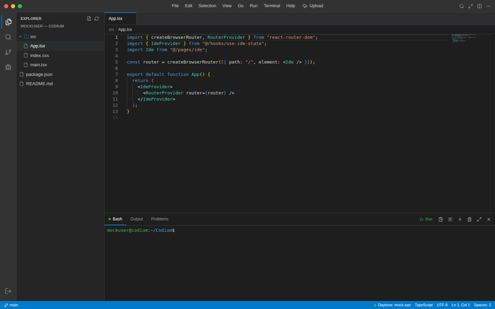

# Codium

A browser-based cloud IDE that connects to live Daytona sandboxes — pick a repo, get a full coding environment, right in your browser.

**Live:** [codium-theta.vercel.app](https://codium-theta.vercel.app)

> **Proprietary & Confidential.** This repository and its contents are the exclusive property of the Owner. Access is restricted to authorized collaborators only. See [`CODE_OF_CONDUCT.md`](./CODE_OF_CONDUCT.md) and [`LICENSE.txt`](./LICENSE.txt) before accessing, cloning, or contributing.

---

## What it does

Codium turns any GitHub repo into a fully working remote dev environment inside the browser:

- **Sign in with GitHub**, pick a repository, and get a live sandbox spun up on demand
- **Monaco Editor** for a real VS Code-grade editing experience
- **Real terminal** — a genuine PTY via `script(1)` (no `node-pty` dependency), streamed over WebSocket with `xterm.js`
- **Live port detection** — polls `/proc/net/tcp` and `/proc/net/tcp6` inside the sandbox to auto-discover running dev servers and expose preview URLs
- **File tree backed by the live sandbox filesystem** — not a cached copy. Open, edit, and save operate directly against the sandbox
- **Auto-save** to the sandbox with debounced writes, and explicit **Save to GitHub** with SHA-aware commits

## Screenshot

The interface follows a familiar editor layout: a file explorer on the left scoped to the active sandbox, a Monaco-powered editor pane in the center with full syntax highlighting, and an integrated terminal panel along the bottom wired directly into the sandbox's shell. The status bar reports the live Daytona sandbox identity, language mode, encoding, and cursor position at all times, so it's always clear which remote environment is currently attached.

## Architecture

The frontend is a React and TypeScript application built with Vite and styled with Tailwind CSS. Application state is centralized through a custom hook, `use-ide-state`, built on React's Context API, which tracks everything from the active GitHub token and selected repository to open tabs, their dirty state, and the live file tree pulled from the sandbox. A dedicated Daytona client module wraps sandbox lifecycle operations — creating a sandbox, executing shell commands inside it, writing files to its filesystem, and resolving exposed ports — while a separate GitHub API wrapper handles authentication and repository operations independently of the sandbox layer. The editor experience itself is composed of modular UI pieces: a Monaco-based code editor, a terminal panel, a file tree component, and supporting chrome, all of which read and write through the shared IDE state rather than talking to the backend directly.

Behind the frontend sits a set of Vercel serverless functions that act as the bridge to Daytona. One function provisions a new sandbox and injects a small terminal server into it at creation time; another executes arbitrary commands inside a running sandbox; another writes file contents to the sandbox's filesystem; and a fourth resolves the public preview URL for a given port once a dev server starts listening on it. Each of these functions is deliberately narrow in scope, so the frontend orchestrates behavior by composing calls to them rather than relying on any single monolithic API surface.

The most important architectural decision in Codium is that the **live sandbox filesystem is the single source of truth**, not the local browser state and not GitHub. When a file is opened, its contents are read by running a shell command inside the sandbox rather than from any cached copy. When a file is edited, changes are debounced and written straight back to the sandbox filesystem, so the sandbox always reflects the current state of the code as the user sees it. GitHub only enters the picture when the user explicitly chooses to save: at that point, Codium resolves the current SHA of the target file and commits the change through GitHub's Contents API, keeping the sandbox and the remote repository in sync without ever treating the repository as the live working copy. The terminal follows the same philosophy — rather than depending on a native PTY library, Codium uploads a small Node.js terminal server into the sandbox itself at creation time, which uses `script` to allocate a real pseudo-terminal, and streams that session to the browser over a WebSocket, rendered client-side with xterm.js and its fit addon. To support live preview links, that same terminal server periodically polls the sandbox's own network state to detect newly opened ports and reports them back so the frontend can offer a working preview URL the moment a dev server starts.

## Stack

| Layer | Technology |
|---|---|
| Frontend | React, Vite, TypeScript, Tailwind CSS |
| Editor | Monaco Editor |
| Terminal | xterm.js + FitAddon, custom Node.js PTY server |
| Sandboxing | Daytona SDK |
| Hosting | Vercel (frontend + serverless API) |

## Deployment targets

Codium isn't limited to the web. Related builds extend the same core to:

- **Android** (native, Jetpack Compose/Kotlin)
- **Tablet** (Capacitor)
- **Offline** (isomorphic-git + Pyodide for in-browser Python)
- **Linux** (proot + rootfs, Termux-style native PTY bridge)

## Status

Actively developed. This is deployable infrastructure, not a prototype — used as a working showcase of what can be built on top of the Enter platform.

## Access & Contributions

This repository is **not open source**. Cloning, contributing, or referencing any part of the codebase, design system, or architecture outside of explicit written authorization from the Owner is prohibited. Authorized collaborators must follow the terms in [`CODE_OF_CONDUCT.md`](./CODE_OF_CONDUCT.md).

For access requests or questions, contact the Owner: **Sohan Ananthula**.

## License

See [`LICENSE.txt`](./LICENSE.txt).
